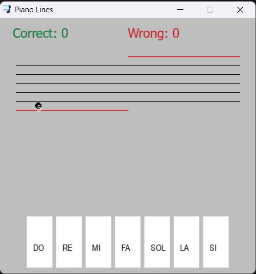

# Piano Lines

**A tool for practicing and learning musical notes.**

## Usage

Guess the displayed note by using the keyboard (**'A' (do), 'S' (re), 'D' (mi), 'F' (fa), 'G' (sol), 'H' (la), 'J' (si)**) keys or clicking on the specified keys in the app.
